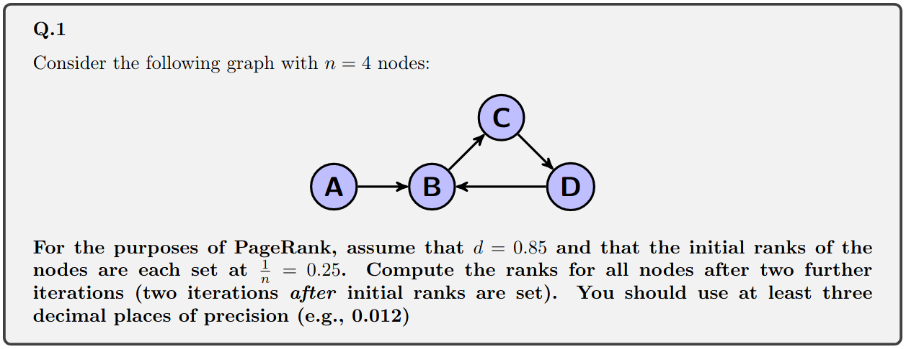
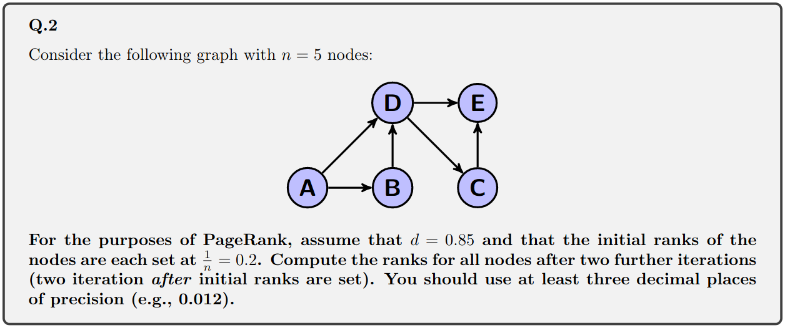

# Link Analysis

## Questions

### ➡️ What are in-links and out-links for a web page?

- **In-links:** links in other pages that point to a web page;
- **Out-links:** links in a web page that point to other pages.

### ➡️ How is anchor text used in web search?

Anchor text is the text used in HTML anchor (`a`) tags. It represents how other pages refer to a certain page, meaning it can potentially be used as a signal, but also lead to misleading results (Google bombing)

### ➡️ Calculate PageRank values for a set of linked documents.



|  | 1 | 2 | 3 |
| ---- | ---- | ---- | ---- |
| A | 0.250 | 0.038 | 0.038 |
| B | 0.250 | 0.462 | 0.282 |
| C | 0.250 | 0.250 | 0.430 |
| D | 0.250 | 0.250 | 0.250 |

**Iteration 2**

```
PR(A) = (1-0.850)/4 + 0.850*0 = 0.038
PR(B) = (1-0.850)/4 + 0.850*(0.250/1 + 0.25/1) = 0.462
PR(C) = (1-0.850)/4 + 0.850*(0.250/1) = 0.250
PR(D) = (1-0.850)/4 + 0.850*(0.250/1) = 0.250
```

**Iteration 3**

```
PR(A) = (1-0.850)/4 + 0.850*0 = 0.038
PR(B) = (1-0.850)/4 + 0.850*(0.038/1 + 0.250/1) = 0.282
PR(C) = (1-0.850)/4 + 0.850*(0.462/1) = 0.430
PR(D) = (1-0.850)/4 + 0.850*(0.250/1) = 0.250
```



|  | 1 | 2 | 3 |
| ---- | ---- | ---- | ---- |
| A | 0.200 | 0.030 | 0.030 |
| B | 0.200 | 0.115 | 0.043 |
| C | 0.200 | 0.115 | 0.151 |
| D | 0.200 | 0.285 | 0.140 |
| E | 0.200 | 0.285 | 0.249 |

**Iteration 2**

```
PR(A) = (1-0.850)/5 + 0.850*0 = 0.030
PR(B) = (1-0.850)/5 + 0.850*(0.200/2) = 0.115
PR(C) = (1-0.850)/5 + 0.850*(0.200/2) = 0.115
PR(D) = (1-0.850)/5 + 0.850*(0.200/2 + 0.200/1) = 0.285
PR(E) = (1-0.850)/5 + 0.850*(0.200/1 + 0.200/2) = 0.285
```

**Iteration 3**

```
PR(A) = (1-0.850)/5 + 0.850*0 = 0.030
PR(B) = (1-0.850)/5 + 0.850*(0.030/2) = 0.043
PR(C) = (1-0.850)/5 + 0.850*(0.285/2) = 0.151
PR(D) = (1-0.850)/5 + 0.850*(0.0.030/2 + 0.115/1) = 0.140
PR(E) = (1-0.850)/5 + 0.850*(0.115/1 + 0.285/2) = 0.249
```

### ➡️ Calculate Hub and Authority values for a set of linked documents.


**Iteration 1**

```
H = (1, 1, 1, 1)
A = (1, 1, 1, 1)
```

**Iteration 2**

```
H = (1, 1, 1, 1) -> (0.5, 0.5, 0.5, 0.5)
A = (0, 2, 1, 1) -> (0, 0.816, 0.408, 0.408)
```

**Iteration 3**

```
H = (0.816, 0.408, 0.408, 0.816) -> (0.632, 0.316, 0.316, 0.632)
A = (0, 1, 0.5, 0.5) -> (0, 0.816, 0.408, 0.408)
```


**Iteration 1**

```
H = (1, 1, 1, 1, 1)
A = (1, 1, 1, 1, 1)
```

**Iteration 2**

```
H = (2, 1, 1, 2, 0) -> (0.632, 0.316, 0.316, 0.632, 0)
A = (0, 1, 1, 2, 2) -> (0, 0.316, 0.316, 0.632, 0.632)
```

**Iteration 3**

```
H = (0.948, 0.632, 0.632, 0.948, 0) -> (0.589, 0.392, 0.392, 0.589, 0)
A = (0, 0.632, 0.632, 0.948, 0.948) -> (0, 0.392, 0.392, 0.589, 0.589)
```